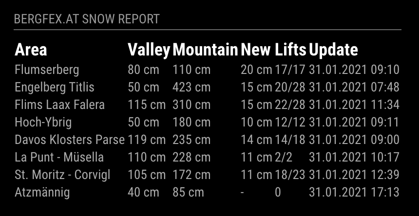

# MMM-bergfex.at
bergfex.at snow reports retrieved from http://www.bergfex.at/oesterreich/schneewerte/. 

Available countries are listed on Bergfex.at



### Download and Installation 

To use this module, clone this repository to your __modules__ folder of your MagicMirror: `git clone https://github.com/FatTony404/MMM-bergfex.git`

Go to `MMM-bergfex` module directory and run `npm install`. 


### Configuration

The module needs the default configuration block in your config.js to work.

See following example configuration: 

```
{
	module: 'MMM-bergfex',
	position: 'top_right', 
	classes: 'small dimmed', 
	config: {
		updateInterval: 30*60*1000,
		animationSpeed: 0,
		header: 'bergfex.at Snow Report',
		skiareas: [
			'Hochkar',
			'Koralpe'
		],
		shortenArea: 20,
		cssclassrow: 'normal',
		cssclassheader: 'bright',
		country: 'oesterreich',	
		showUpdateHint: true,			
	}
},
```

The following properties can be configured:

|Option|Description|Values|Default|
|---|---|---|---|
|updateInterval|The update interval. Determines the refresh rate in ms at which sensor is read.<br>**Example:** `updateInterval: 10000`|int|`30*60*1000`ms = 30min|
|animationSpeed|Speed of animation when updates occur.<br>**Example:** `animationSpeed: 0`|int|0|
|header|The name that should be displayed at the top of the module<br>**Example:** `header: 'bergfex.at'`|String|'bergfex.at'|
|skiareas|This is an array with strings of the skiareas to display. String must exactly match the name on http://www.bergfex.at/oesterreich/schneewerte/<br>|array of strings|''|
|shortenArea|number of characters skiarea names will be shortened to.<br>**Example:** `shortenArea: 20`|int|20|
|cssclassheader|CSS class for the table header (bright, normal, etc).<br>**Example:** `cssclassheader: normal`|String|'normal'|
|cssclassrow|CSS class for the table rows (normal, light, etc).<br>**Example:** `cssclassrow: light`|String|'light'|
|country|Bergfex.at country. Determines which country is selected when fetching the snow values.<br>**Example:** `country: oesterreich`|String|'oesterreich', 'schweiz'|
|showDate|Shows the update time.<br>**Example:** `showDate: true`|boolean|'true','false'|